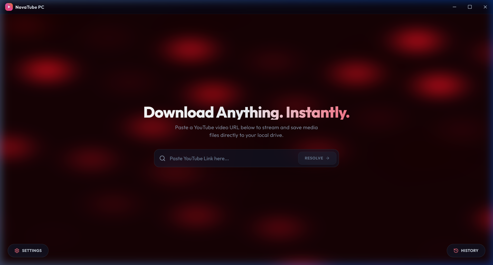
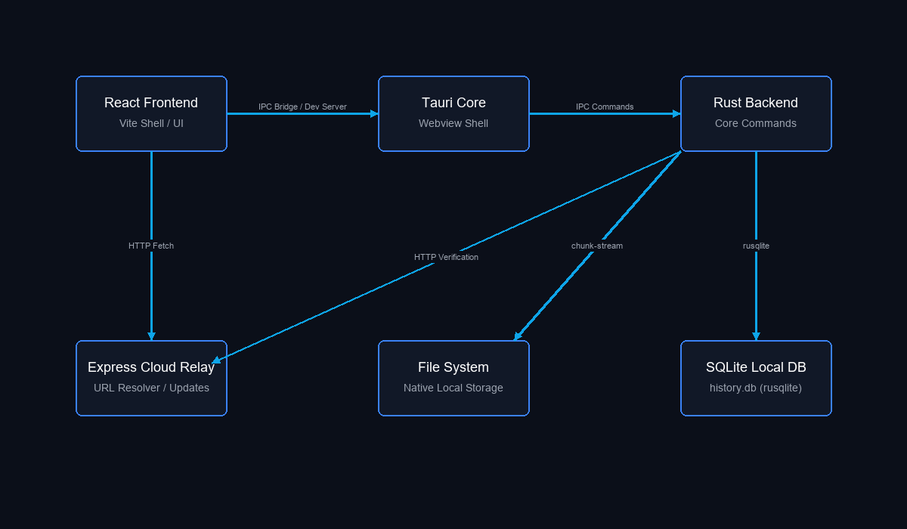
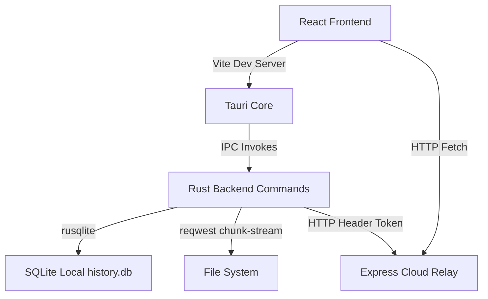

<div align="center">

# ┌─── ❖ NovaTube ❖ ───┐

<p align="center">
  
</p>

### [ Native Desktop Media Downloader | Tauri 2.0 + React 19 + Rust ]

[](https://tauri.app/)
[](https://react.dev/)
[](https://www.rust-lang.org/)
[](LICENSE)

<br/>

<code><b>[+] Glassmorphic UI</b></code> &nbsp;•&nbsp;
<code><b>[+] WebGL Background</b></code> &nbsp;•&nbsp;
<code><b>[+] Rust Streaming</b></code> &nbsp;•&nbsp;
<code><b>[+] SQLite History</b></code>

<br/><br/>

<a href="#features"><b>[ Features ]</b></a> &nbsp;•&nbsp;
<a href="#system-architecture"><b>[ System Architecture ]</b></a> &nbsp;•&nbsp;
<a href="#developer-setup"><b>[ Developer Setup ]</b></a> &nbsp;•&nbsp;
<a href="#windows-compilation-workarounds"><b>[ Compilation Workarounds ]</b></a> &nbsp;•&nbsp;
<a href="#usage-guide"><b>[ Usage Guide ]</b></a>

</div>

---

### [+] Features

* **Premium Glassmorphic Design**
  * High-fidelity native interface styled with CSS blurs, translucent window backgrounds, and active state micro-animations.
* **WebGL Liquid Noise Background**
  * A canvas rendering fluid, organic vector noise fields reactive to cursor positions, running on `@react-three/fiber` (Three.js).
* **Custom Frameless Window Chrome**
  * A completely custom title bar that allows dragging and binds standard Minimize, Maximize, and Close event operations.
* **Asynchronous Multi-Threaded Rust Downloader**
  * Spawns a dedicated Rust channel chunk-streaming download payload bytes using `reqwest` and emits real-time speed, percentage, and size data back to the UI.
* **Persistent SQLite Local DB Log**
  * Log history is written natively to a local database (`history.db`) in the user profile directory via `rusqlite`.
* **System Tray Integration**
  * Standard minimize-to-tray event handler upon close with context menus ("Open NovaTube", "Check for Updates", "Quit") and double-click restorations.
* **Auto-Update Banners**
  * Performs automatic version checks against the express relay server on boot, popping update alerts when newer revisions are available.

---

### [+] System Architecture

The client front-end communicates with the native OS layer outside the webview sandbox using Tauri's inter-process communication (IPC) bridges:

<p align="center">
  
</p>

<details>
<summary><b>[+] Show Mermaid Flowchart Source</b></summary>


</details>

* **React Desktop Shell**
  * The frontend user interface constructed with React and Tailwind CSS.
* **Rust Backend Engine**
  * Handles disk operations, SQL database storage, network requests, and system tray operations.
* **Express Cloud Relay**
  * Lightweight cloud relay server that assists in link resolution and provides software version updates. It validates requests using signing headers (`x-novatube-signature`).

---

### [+] Developer Setup

Ensure you have these system dependencies pre-configured:
* **Node.js**: LTS version (v18+)
* **Rust**: Stable compiler toolchain (targets `x86_64-pc-windows-gnu` GNU targets)
* **MinGW / GCC Linker**: Required for linking standard binary assemblies on Windows

#### Step 1: Start the Cloud Relay Server
Navigate to the relay sub-folder, install the dependencies, and start the node listener:
```bash
cd relay-server
npm install
npm run start
```
*Note: The relay backend serves requests at http://localhost:3000.*

#### Step 2: Set Path Variables
Append Cargo and your GCC binaries to the shell environment path:
```powershell
$env:PATH = "$env:USERPROFILE\.cargo\bin;C:\Program Files (x86)\Embarcadero\Dev-Cpp\TDM-GCC-64\bin;$env:PATH"
```

#### Step 3: Launch Tauri Dev Client
From the project workspace root, initialize node packages and boot the client app:
```bash
npm install
npm run tauri dev
```

---

### [+] Windows Compilation Workarounds

When compiling inside drive directories that contain space characters (e.g., `D:\ENGINEERING\SOLO MAJOR PROJECT\Snaptube PC`), the default GNU linker helper (`windres.exe`) fails due to parsing constraints on space boundaries.

To bypass this build system limitation:

* **Directory Junction Symlinks**
  * The custom `run-dev.ps1` script creates a junction symlink at the root level of your drive (`D:\novatube_temp`) which contains no spaces, then executes build commands within that target directory.
* **Relative Linker Configuration**
  * The cargo flag file inside `src-tauri/.cargo/config.toml` redirects the library search path:
    ```toml
    [target.x86_64-pc-windows-gnu]
    rustflags = [
      "-L", "D:\\novatube_temp\\src-tauri\\libgcc_link"
    ]
    ```
* **Developer Launch Command**
  * Run the powershell dev target command directly:
    ```bash
    npm run dev:win
    ```

---

### [+] Usage Guide

1. **Resolve URL**: Paste any direct media URL into the target address field and click **Resolve**. In Mock Mode (no API key defined), the client automatically returns standard 360p, 720p, and 1080p open-source sample video sources.
2. **Select Format**: Click on the format card matching your requirements.
3. **Select Location**: Save files through the native operating system file explorer dialog.
4. **Track Progress**: Real-time progress displays current download metrics, speeds, and sizes. A native system notification toast is triggered once the file successfully completes saving to disk.
5. **Review History Log**: Open the history drawer located in the bottom-right viewport to review previous downloads stored in your SQLite database. Clicking **Open File** launches the target file using your default native application.
