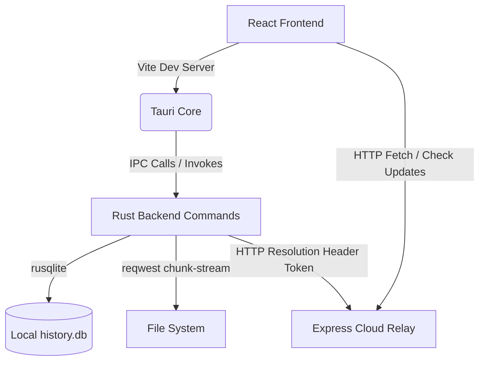

# SnapTube PC - Native Desktop Application

**SnapTube PC** is a high-performance, installable native Windows desktop client converted from a hosted web app using the modern **Tauri 2.0 + React** stack. It features a custom frameless glass design, custom liquid WebGL background shaders, asynchronous Rust streaming download engines, local SQLite history logging, system tray controls, and auto-update checks via a thin cloud relay server.

---

## 🚀 Key Features

*   **Premium Glassmorphic UI**: High-fidelity custom glass layout with dynamic backdrop blurs, responsive transitions, and hover micro-animations.
*   **WebGL Liquid Noise Background**: Reactive background canvas rendering fluid noise fields reacting to mouse movement, built using `@react-three/fiber` (Three.js).
*   **Frameless Window Title Bar**: Completely custom draggable title bar with Minimize, Maximize, and Close control bindings.
*   **Asynchronous Multi-Threaded Downloader**: Core Rust download command streaming bytes chunk-by-chunk using `reqwest` and emitting progress events (speed, percentage, downloaded bytes) to the UI.
*   **Persistent Local History**: Native SQLite-backed historical log powered by `rusqlite` saving your download metrics (`history.db`) in your user profile's Roaming directory.
*   **System Tray Integration**: Minimize-to-tray logic on window close with context menus ("Open App", "Check for Updates", "Quit") and double-click to restore.
*   **Auto-Update Banners**: Checks local version details against a thin Express relay server at startup and alerts the user of newer versions via automated UI notifications and tray triggers.

---

## 🛠️ Architecture: How It Works



1.  **React Desktop Shell**: A Vite React client compiled with Tailwind CSS. It communicates with the backend shell using Tauri's IPC event bridges (`invoke`, `listen`).
2.  **Rust Backend Engine**: Manages desktop native interactions (disk IO, database connections, and tray operations) outside the Webview sandbox.
3.  **Express Cloud Relay**: A thin, secure backend relay API facilitating URL resolution and checking for software updates. It implements rate-limiting, signature headers (`x-snaptube-signature`), and a local **Mock Mode** for offline testing.

---

## ⚙️ Developer Setup & Run Instructions

### Prerequisites
*   **Node.js**: LTS version (v18+)
*   **Rust**: Stable toolchain (Tauri targets the `x86_64-pc-windows-gnu` GNU toolchain if Microsoft Visual Studio SDK is missing).
*   **MinGW / GCC Linker**: For compilation on GNU targets (such as Dev-C++'s TDM-GCC compiler).

### Step 1: Start the Cloud Relay Server
Navigate to the relay server directory, install dependencies, and start the listener:
```bash
cd relay-server
npm install
npm run start
```
The server will run on `http://localhost:3000`.

### Step 2: Configure Environment Paths (Tauri App)
Ensure your MinGW binaries and Cargo are registered in your Path:
```powershell
$env:PATH = "$env:USERPROFILE\.cargo\bin;C:\Program Files (x86)\Embarcadero\Dev-Cpp\TDM-GCC-64\bin;$env:PATH"
```

### Step 3: Run the Development Server
From the workspace root directory:
```bash
npm install
npm run tauri dev
```

---

## 🛠️ Windows Compilation Workarounds

If you compile the application inside folders containing spaces (e.g. `D:\ENGINEERING\SOLO MAJOR PROJECT\Snaptube PC`) using MinGW, the Windows resource compiler (`windres`) may throw preprocessing errors. 

To bypass this path space parsing bug:
1.  Create a directory junction (symlink) without spaces pointing to the project:
    ```powershell
    New-Item -ItemType Junction -Path "D:\snaptube_temp" -Value "D:\ENGINEERING\SOLO MAJOR PROJECT\Snaptube PC"
    ```
2.  Update the linker config at `src-tauri/.cargo/config.toml` to link to the symlink path:
    ```toml
    [target.x86_64-pc-windows-gnu]
    rustflags = [
      "-L", "D:\\snaptube_temp\\src-tauri\\libgcc_link"
    ]
    ```
3.  Navigate to `D:\snaptube_temp` inside the shell and execute `npm run tauri dev` from there.

---

## 📖 How to Use & Test

1.  **Resolve Video**: Paste a video URL (e.g. `https://www.youtube.com/watch?v=dQw4w9WgXcQ`) into the search bar and press **Enter** or click **Resolve**.
    *   *Note: In Mock Mode (default), the cloud relay returns a simulated set of resolutions (360p, 720p, 1080p) pointing to open-source test videos.*
2.  **Select Format**: Click on the resolution card you want to download.
3.  **Choose Location**: A native file dialog appears. Select your folder and click **Save**.
4.  **Download Streaming**: Watch real-time download speeds and percentages populate on the interface. A native OS notification will fire on completion.
5.  **History Drawer**: Toggle the **History** panel in the bottom-right corner to see a persistent log of your downloaded files, which are saved in the local SQLite table. Clicking **Open File** will open the local path directly.
